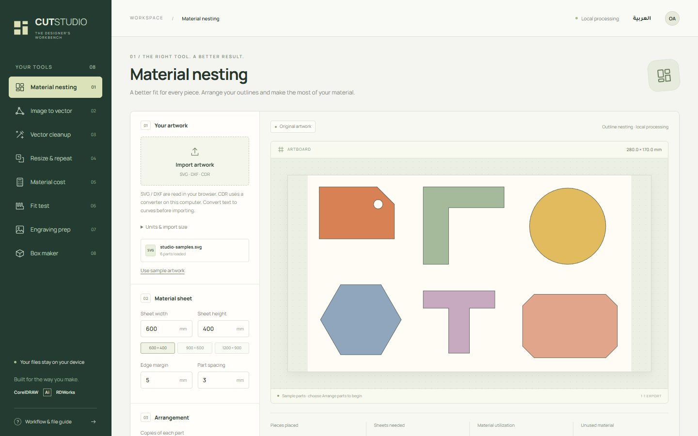
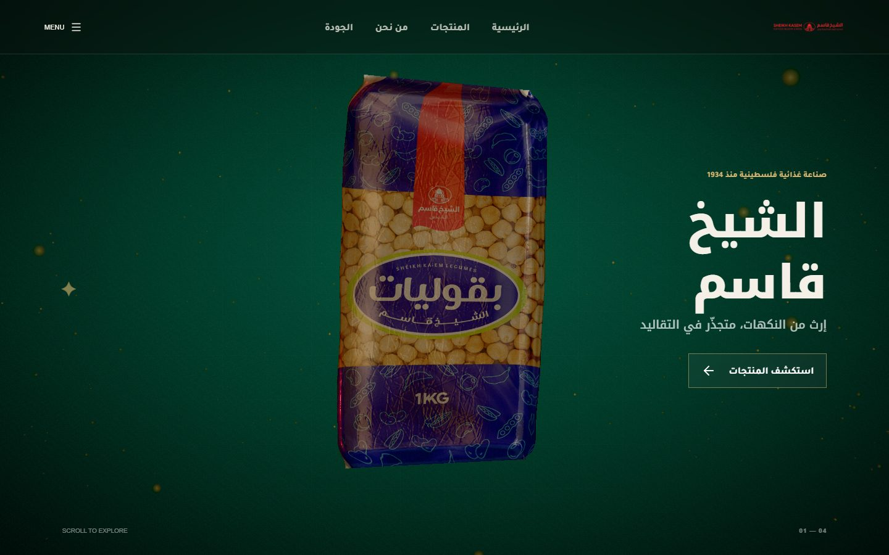
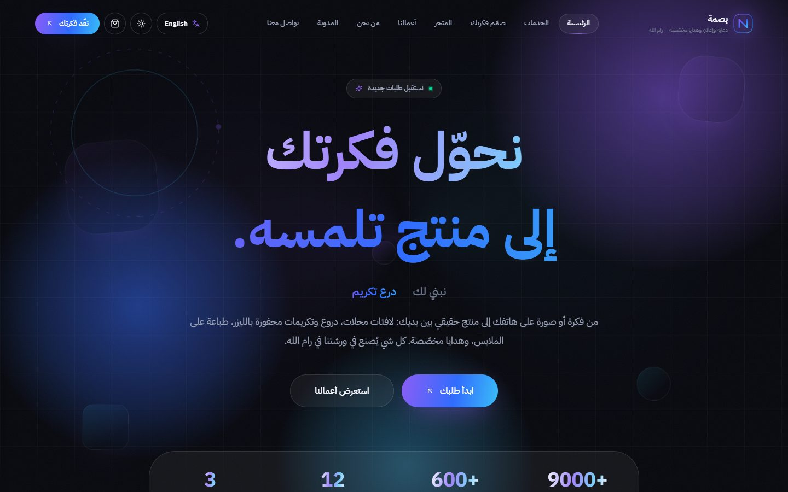
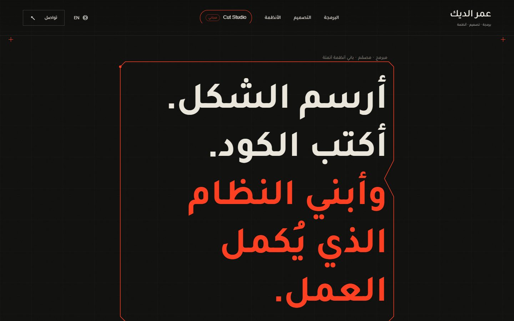

# Omar Aldeek · عمر الديك

**Developer · Designer · Automation builder**
مبرمج · مصمّم · باني أنظمة أتمتة

I build bilingual (Arabic-first) websites, workshop tools, and AI automation, and I run a signage and laser workshop in Palestine, so the tools I write get used on real machines every day.

[Portfolio](https://omaraldeek3.github.io/ar/) · [Cut Studio](https://omaraldeek3.github.io/tools/) · [Contact](https://omaraldeek3.github.io/ar/#contact)

---

## Selected work

### Cut Studio: a free design and laser toolkit in the browser

Twenty-three tools I use in my own workshop: material nesting, image to vector (colour and outline modes), an AI upscaler for large-format print, poster tiling, contour offset, Arabic and English lettering as cut paths, box maker, engraving prep, material cost and more. Everything runs locally in the browser, and exports open cleanly in CorelDRAW, Illustrator and RDWorks.

`Next.js` `TypeScript` `ONNX Runtime Web` `Real-ESRGAN` `HarfBuzz` `Playwright`
**[Open Cut Studio](https://omaraldeek3.github.io/tools/)** · [Source](https://github.com/Omaraldeek3/Omaraldeek3.github.io)

### Sheikh Kasem: food and spices company site

An Arabic RTL site for a Palestinian food manufacturer founded in 1934, with a photoreal 3D product in the hero.

`React 19` `Three.js` `Vite`
**[Live site](https://omaraldeek3.github.io/sheikhkasem3/)** · [Source](https://github.com/Omaraldeek3/sheikhkasem3)

### Basma: signage and gifts store

A bilingual storefront for a signage, engraving and custom-gifts workshop in Ramallah. The owner edits products in Sanity CMS, and customers order through WhatsApp.

`Next.js 15` `Sanity CMS` `Tailwind CSS 4` `Zustand`
**[Live site](https://basma-store.vercel.app/ar)** · source is private (client project)

### Arabic Shorts Factory: an automation pipeline
A system that writes, checks, voices, renders and publishes short videos every day without supervision. n8n schedules each step, one language model writes the script and a second one takes over if the first fails, a validator rejects scripts that break the rules, and the finished video goes out to YouTube and TikTok.

`n8n` `LLMs` `ElevenLabs` `edge-tts` `MoneyPrinterTurbo` `VPS`
**[See it in the lab](https://omaraldeek3.github.io/ar/#lab)** · source is private

### This portfolio

Bilingual (Arabic and English), built for the phone first, with twenty design studies and a lab of SaaS and automation demos.

**[Visit](https://omaraldeek3.github.io/ar/)** · [Source](https://github.com/Omaraldeek3/Omaraldeek3.github.io)

---

## What I work with

**Code:** TypeScript, React, Next.js, Tailwind CSS, Three.js, Node.js, Sanity CMS, Playwright
**Automation and AI:** n8n, LLM APIs, ONNX Runtime, ElevenLabs
**Design and fabrication:** CorelDRAW, Illustrator, Photoshop, RDWorks; CO2 and fiber laser, CNC router, vinyl plotter, large-format and sublimation printing

---

## بالعربي

أبني مواقع وتطبيقات ويب عربية أولاً، وأدوات للورش، وأنظمة أتمتة بالذكاء الاصطناعي. وعندي ورشة دعاية وإعلان وقص ليزر في فلسطين، فالأدوات التي أكتبها تُستخدم كل يوم على آلات حقيقية.

- **[Cut Studio](https://omaraldeek3.github.io/tools/)**: ثلاث وعشرون أداة مجانية للتصميم والقص بالليزر تعمل في المتصفح.
- **[الشيخ قاسم](https://omaraldeek3.github.io/sheikhkasem3/)**: موقع شركة مواد غذائية وتوابل بمنتج ثلاثي الأبعاد.
- **[بصمة](https://basma-store.vercel.app/ar)**: متجر لورشة دعاية وهدايا في رام الله، والطلب عبر واتساب.
- **مصنع الشورتس العربي**: نظام ينتج فيديوهات قصيرة وينشرها كل يوم دون تدخّل.

لطلب موقع أو أداة أو نظام أتمتة: **[تواصل معي](https://omaraldeek3.github.io/ar/#contact)**

